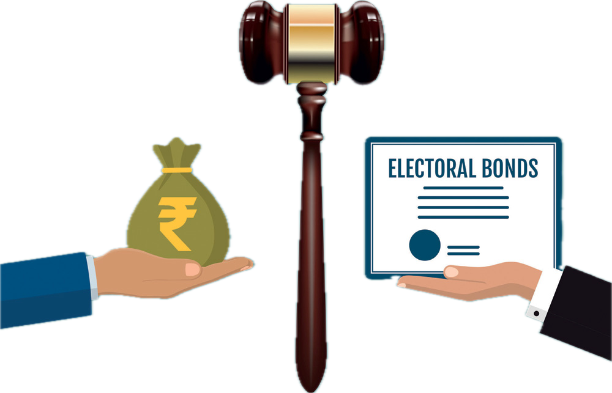
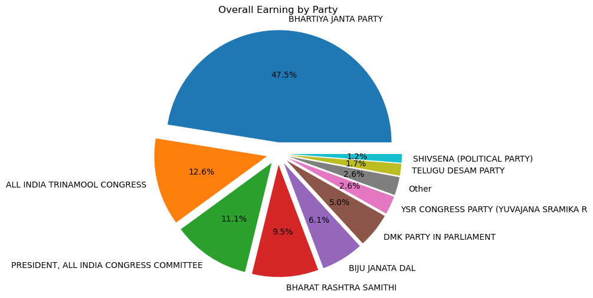

# Electoral_Bond

##Introduction 

Electoral Bond was a mode of funding to the political parties in India. The scheme of Anonymous Electoral Bond was introduced in The Finance Bill, 2017 during Union Budget 2017-18. It was struck down as unconstitutional by the Supreme Court on 15 February 2024.

Supreme court ordered SBI and ECI to release Electoral Bond data as soon as they released,
i am trying to establish any relation possible between lender and provider of donation.
# Insight
From the initial dataset released by SBI we can gain some insight as which company donated how much and which political party encashed how much, there are few more insight....

from above chart we can clearly see donation of ruling party, whereas some state party got more donation then oldest national party, and out of 26 party only 6 party bagged more then 91% of donation.